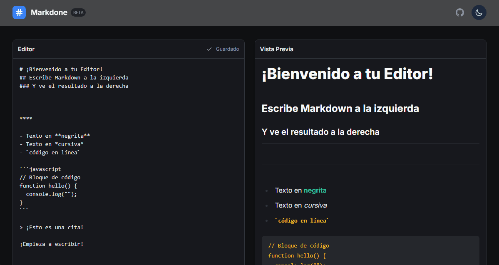

# Editor de Markdown en Tiempo Real ✏️

> Una herramienta web simple y elegante para escribir y previsualizar Markdown en tiempo real. Construida con Next.js 15 y Tailwind CSS v4, incluye autoguardado en el navegador y un tema oscuro.

**Prueba la herramienta en vivo:** [**https://markdone.vercel.app/**](https://markdone.vercel.app/)

---

## ✨ Características

* **✍️ Editor y Vista Previa en Vivo:** Escribe Markdown a la izquierda y ve el resultado renderizado al instante a la derecha.
* **🌗 Tema Claro y Oscuro:** Cambia entre modos para una experiencia de visualización cómoda.
* **💾 Autoguardado Automático:** Tu trabajo se guarda automáticamente en el `localStorage` de tu navegador. ¡No pierdas ni una letra!
* **💅 Estilizado con Tailwind Typography:** La vista previa está formateada de forma limpia y legible.

---

## 🛠️ Stack Tecnológico

